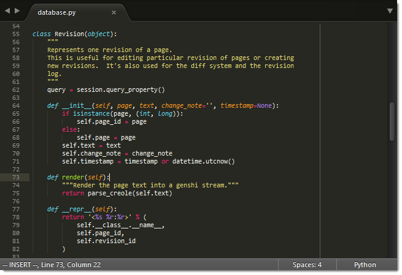

Sublime Text uses color schemes
to highlight source code
and to define the colors
of some items in the editing area:
background, foreground, gutter, caret, selection...

Color schemes are fully customizable.

Let's look at a Python file
as Sublime Text highlights it
using the default color scheme *Monokai*:

<!-- .. TODO this is incredibly outdated -->

# Selecting a Color Scheme

You can change the current color scheme
by means of the **Preferences → Color Scheme** menu.

A common way of selecting a color scheme
is by associating it to a type of file
using file-type-specific settings.
Select **Preferences → Settings - Syntax Specific**
to open the corresponding settings file
and set the `color_scheme` setting.

For more information about settings, see [settings](./settings).

::: tip See Also
[Reference for color schemes](/reference/color_schemes)
: Complete reference on color scheme settings.
:::
