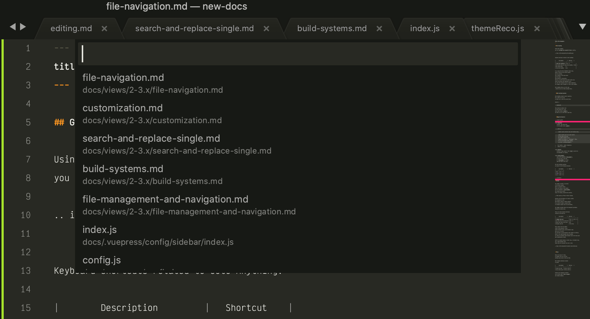

## Goto Anything

Using Goto Anything,
you can **navigate your project's files** swiftly.



Keyboard shortcuts related to Goto Anything:

|        Description         |   Shortcut    |
| ------------------------ | ---------- |
| **Open Goto Anything** | Ctrl + P               |
| Pin current item and close Goto Anything  | Enter |
| Pin current item       | →                      |
| Close Goto Anything    | Esc                    |

As you type into Goto Anything's input area,
names of files in the current project
will be searched,
and a preview of the best match
will be shown.
This preview is *transient*;
that is, it won't become the actual active view
until you perform some operation on it.
You will find transient views in other situations,
for example, after clicking on a file in the sidebar.

Goto Anything lives up to its name
--there's more to it than locating files.


### Goto Anything Operators

Goto Anything accepts several operators.
All of them can be used
on their own or after the search term.

**Example:**

```
models:100
```

This instructs Sublime Text
to first search for a file
whose path matches ``models``,
and then to go to line 100 in said file.


#### Supported Operators

.. _fm-goto-symbol:

:samp:`@{symbol}`
    Searches  the active file
    for the symbol named ``symbol``.

::: tip Note
Symbols usually include class and function names.

Symbol searches will only yield results
if the active file type
has symbols defined for it.
Symbols are defined in ``.tmLanguage`` files.
For more information about symbols,
see [Symbols](../reference/symbols).


See *Symbols - Syntax Preferences*
:::
<!-- (TODO: to be added). -->

:samp:`#{term}`
    Performs a fuzzy search of the ``term`` search term
    and highlights all matches.

:samp:`:{line_number}`
    Goes to the specified ``line_number``,
    or to the end of the file
    if ``line_number`` is larger
    that the file's line count.

The Goto Anything operators
are bound to the following shortcuts:

|        Description         |   Shortcut    |
| ------ | -------- |
| **@**  | Ctrl + R |
| **\#** | Ctrl + ; |
| **:**  | Ctrl + G |

## Sidebar

The sidebar provides an overview
of the active project
(more on projects later).
Files and folders in the sidebar
will be available in [Goto Anything](#goto-anything)
and project-wide actions
like, for example, project-wide searches.

<!-- TODO: maybe say "Find in Files" instead. -->

Projects and the sidebar are closely related.
It's important to note
that there's always an active project;
if you haven't opened a project file,
an anonymous project will be used instead.

The sidebar provides basic file management operations
through its context menu.

These are common keyboard shortcuts
related to the side bar:

|        Description         |   Shortcut    |
| ------------------------------ | ------------------ |
| **Toggle side bar**            | Ctrl + K, Ctrl + B |
| Give the focus to the side bar | Ctrl + 0           |
| Return the focus to the view   | Esc                |
| Navigate side bar              | Arrow keys         |

Files opened from the sidebar
create *semi-transient* views.
Unlike transient views, semi-transient views
show up as a new tab.
The tab title of semi-transient views appears in italics.
Before a new semi-transient view is opened,
any other pre-existing semi-transient view in the same pane
gets automatically closed.

Here's an example showing a normal view, a transient view,
and a semi-transient view.
Notice that the transient view has no tab:


## Panes

Panes are groups of views.
In Sublime Text, you can have
multiple panes open at the same time.

Main keyboard shortcuts related
to panes:

|        Description         |   Shortcut    |
| ----------------- | -------------- |
| Create new pane   | Ctrl+K, Ctrl+↑ |
| Close active pane | Ctrl+K, Ctrl+↓ |

Further pane management commands
can be found under **View → Layout**
and related submenus.